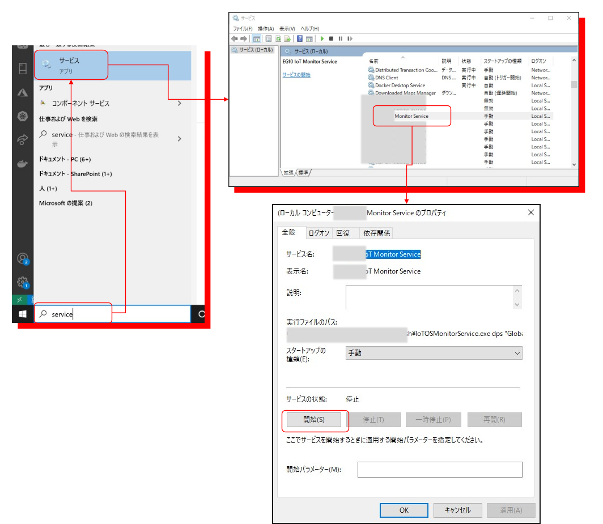

# Tips for IoT App run on Windows Service
Windows PC の CPU 使用率など、HWリソースの利用状況を定期的に計測し、IoT Hub を通じてクラウドサービスに通知するサンプル。  
このようなロジックは、Windows PC に常駐して動作するのが望ましいと考えらえるので、バックグラウンドでロジックを実行する Windows Service を利用する。  
ロジックの判りやすさを担保するためと、Windows Platform で動くことを考慮して、ロジックは C# で記述する。他の言語で作成したい場合は、このサンプルを参考にして適宜翻訳してプログラミングをしていただきたい。  


このサンプルで学べるトピックスは以下の通りです。  
- Windows Servie アプリケーションの作成方法  
- Device Provisioning Service の Group Enrollment(SASKey) による IoT Device の IoT Hub への登録方法  
- SASKey による IoT Hub への接続方法  
- Device Twin Reported Properties を使ったクラウド側への情報の通知  
- Device Twin Desired Properties を使ったクラウド側からの設定取得  
- Device to Cloud メッセージ送信方法  
- CPU 使用率の取得方法    
- 引数を渡して Windows Service を起動  

## Windows Service で動くアプリの開発方法  
基本的な流れは、https://docs.microsoft.com/ja-jp/dotnet/core/extensions/windows-service に書いてあるので、まずご一読いただきたい。  
一部必要な事項が抜けていたりもするので、それを補足しながら以下に順を追って解説する。  
フレームワークは、2021/7/13 時点で最新安定板の <b>.NET Core 5.0</b> を使用する。  
https://dotnet.microsoft.com/download/dotnet から、実行する Windows PC の CPU アーキテクチャに合わせて、SDK の Installer をダウンロードし、インストールする。  
開発は、[VS Code](https://code.visualstudio.com/) を使って行う。VS Code による C# アプリケーションの開発の基本は、https://docs.microsoft.com/ja-jp/dotnet/core/tutorials/with-visual-studio-code を参考にしてほしい。  
開発用 Windows PC の適当な場所にフォルダーを作成し、VS Code でそのフォルダーを開く。  

### Windows Service アプリプロジェクトの作成  
VS Code のメニューの Terminal → New Terminal を選択して、ターミナルを表示する。  
開いたターミナルで以下のコマンドを実行する。  

```sh
dotnet new worker --name IoTMonitorService
```
IoTMonitorService という名前のフォルダーが作成され、Windows Service として起動可能なアプリのプロジェクトが作成される。  
次に、アプリ実行に必要な Nuget ライブラリパッケージを順次プロジェクトに追加する。  
```sh
cd IoTMonitorService
dotnet add package Microsoft.Extensions.Hosting.WindowsServices
dotnet add package System.Diagnostics.PerformanceCounter
dotnet add package NewtonSoft.Json
dotnet add package Microsoft.Azure.Devices.Client
dotnet add package Microsoft.Azure.Devices.Provisioning.Client
dotnet add package Microsoft.Azure.Devices.Provisioning.Transport.Amqp
```
それぞれのライブラリの用途を以下に示す。  
|ライブラリ名|用途|
|-|-|
|Microsoft.Extensions.Hosting.WindowsServices|Windows の Background Service 機能（Windows でのみ利用可）|  
|System.Diagnostics.PerformanceCounter|C#で、CPU使用率をはじめとする HW リソース利用状況を取得する（Windows でのみ利用可）|
|NewtonSoft.Json|Jsonを処理するのに便利なライブラリ|
|Microsoft.Azure.Devices.Client|IoT Hub に接続、双方向通信を行う|
|Microsoft.Azure.Devices.Provisioning.Client|Device Provisioning Service を使って接続情報を取得する|
|Microsoft.Azure.Devices.Provisioning.Transport.Amqp|Device Provisioning Service にアクセスする際の通信プロトコルに関する機能|  

※ メモ  
- 最後の二つは、Device Provisioning Service を使うときだけ必要  
- Device Provisioning Service で、HTTPS や MQTTS を使う場合は最後のライブラリではなく対応するライブラリを追加する事  
- <b><u>（Windows でのみ利用可）</u></b> と付記していないライブラリは、Linux 上のあぷケーションでも利用可能  

## Windows Background Service で動くように改造  
生成された、Program.cs を開き、以下の様に CreateHostBuilder メソッドの実装を改造する。  
<b><u>変更前</u></b>  
```cs
        public static IHostBuilder CreateHostBuilder(string[] args) =>
            Host.CreateDefaultBuilder(args)
                .ConfigureServices((hostContext, services) =>
                {
```

<b><u>変更後</u></b>  
```cs
        public static IHostBuilder CreateHostBuilder(string[] args) =>
            Host.CreateDefaultBuilder(args).UseWindowsService()
                .ConfigureServices((hostContext, services) =>
                {
```

Host クラスの CreateDefaultBuilder メソッドと、ConfigureServices メソッドの間に、 UseWindowsService メソッドを追加する。  
※ メモ  
- これが無いと、サービスでアプリを起動したときにタイムアウトになって実行できない。  
- 何となくこのサンプルは、Windows でしか動かないように見えるかもしれないが、https://blog.maartenballiauw.be/post/2021/05/25/running-a-net-application-as-a-service-on-linux-with-systemd.html の説明によれば、Microsoft.Extensions.Hosting.WindowsServices の代わりに、[Microsoft.Extensions.Hosting.Systemd](https://www.nuget.org/packages/Microsoft.Extensions.Hosting.Systemd) を追加し、UseWindowsService() の代わりに UseSystemd() に置き換えれば、Linux の System Daemon として動くらしい。その場合、CPU の使用率の取得については、Linux 用に書き換えは必要。  

## アプリ起動時に指定された引数を Worker に渡す  
このサンプルでは、アプリ起動の際に、プロビジョニング（デバイス接続のための登録やセキュリティ情報取得・設定等）用に以下の様な引数を指定するものとする。  
```sh
IoTMonitorService.exe mode "connection-string"  
```
<b><u>mode</u></b> :  
Provisioning のモード指定。 <b>manual</b> または <b>dps</b> のどちらかを指定する。  

<b><u>connection-string</u></b> :  
connection-string は、IoT Hub または Device Provisioning Service に接続するための文字列。<b><u>mode</u></b> によって異なるフォーマットの文字列を指定する。  
|<b><u>mode</u></b>|<b><u>connection-string</u></b>|フォーマット|
|-|-|-|
|manual|Azure IoT Hub への接続文字列|HostName=...;DeviceId=...;SharedAccessKey=...|
|dps|Device Provisioning Service への接続文字列|GlobalEndpoint=...;IDScope=...;DeviceId=...;SharedAccessKey=...|  

※ メモ  
- connection-string はアプリ起動時ダブルクォーテーションで囲む必要があるのでお忘れなく。  

mode と connection-string は、先に挙げた、<b>CreateHostBuilder</b>メソッドの引数の mode => args[0], connection-string => args[1]で渡されてくる。サンプルでは、mode の値に従って connection-string を解釈し、WorkerConfig というクラスのインスタンスのメンバーに必要な情報を格納して、Worker クラス側に渡している。  

WorkerConfig の宣言  
```cs
    public class WorkerConfig {
        public string IoTHubConnectionString { get; set; }
        public string TestMessage{ get; set; }
        public string Mode { get; set; }
        public string DPSId { get; set; }
        public string DPSGlobalEndpoint { get; set; }
        public string DPSIDScope { get; set; }
        public string DPSSASKey { get; set; }
    }
```
WorkerConfig の解釈  
```cs
        static string GetConfigValue(List<string>configs, string key)
        {
            string value = "";
            var specifiedItem = configs.Where(s => { return s.StartsWith(key); }).First();
            value = specifiedItem.Substring(specifiedItem.IndexOf("=")+1);
            return value;
        }

        static WorkerConfig ParseArgsOrSettings(string mode, string settings)
        {
            var workerConfig = new WorkerConfig()
            {
                Mode = mode,
                TestMessage = $"mode:{mode},settings:{settings}"
            };
            if (mode == "manual")
            {
                workerConfig.IoTHubConnectionString = settings;
            }
            else if (mode == "dps")
            {
                string exceptionMessage = "settings should be \"GlobalEndpoint=...;IDScope=...;DeviceId=...;SharedAccessKey...\"";
                if (!(settings.IndexOf("GlobalEndpoint") >= 0 && settings.IndexOf("DeviceId") >= 0 && settings.IndexOf("IDScope") >= 0 && settings.IndexOf("SharedAccessKey") >= 0))
                {
                    throw new ArgumentOutOfRangeException(exceptionMessage);
                }
                    var configSettings = new List<string>(settings.Split(new char[] { ';' }));
                if (configSettings.Count!=4)
                {
                    throw new ArgumentOutOfRangeException(exceptionMessage);
                }
                workerConfig.DPSGlobalEndpoint = GetConfigValue(configSettings, "GlobalEndpoint");
                workerConfig.DPSId = GetConfigValue(configSettings, "DeviceId");
                workerConfig.DPSIDScope = GetConfigValue(configSettings, "IDScope");
                workerConfig.DPSSASKey = GetConfigValue(configSettings, "SharedAccessKey");
            }
            else
            {
                throw new ArgumentOutOfRangeException("mode should be 'manual' or 'dps'.");
            }
            return workerConfig;
        }
```   
mode で dps を指定した場合は、connection-string を分解して WorkerConfig のプロパティにそれぞれ設定している。manual の場合も分割してもよさそうだが、使い勝手からそのまま文字列を代入している。  
<b>CreateHostBuilder</b> の実装を以下の様にコーディングすれば、  
```cs
        public static IHostBuilder CreateHostBuilder(string[] args) =>
            Host.CreateDefaultBuilder(args).UseWindowsService()
                .ConfigureServices((hostContext, services) =>
                {
                    string mode = "";
                    string connectionString = "";
                    if (args.Count() == 2) {
                        if (args[0] != "dps" && args[0] != "manual") {
                            throw new ArgumentOutOfRangeException("args should be 'dps|manual connectionstring'");
                        }
                        mode = args[0];
                        connectionString = args[1];
                    }
                    var workerConfig = ParseArgsOrSettings(mode, connectionString);
                    services.AddSingleton(workerConfig);
                    services.AddHostedService<Worker>();
                });
```
以下の様に、Worker クラスのコンストラクタに WorkerConfig 型の引数を追加して、workerConfig を受け取る。  
```cs
    public class Worker : BackgroundService
    {
        private readonly ILogger<Worker> _logger;
        private readonly WorkerConfig workerConfig;

        public Worker(ILogger<Worker> logger, WorkerConfig config)
        {
            _logger = logger;
            workerConfig = config;
        }

```

## IoT Hub への接続  
アプリで IoT Hub に接続するには、Azure IoT Hub インスタンスの作成と、IoT Device の登録、及び、登録された IoT Device の接続文字列が必要である。  
https://docs.microsoft.com/ja-jp/azure/iot-hub/iot-hub-create-through-portal の説明に従って IoT Hub インスタンスを作成し、IoT Device を、Authentication Type ： Symmetric key で新規登録する。  
IoT Device を登録して、<b>プライマリ接続文字列</b> を利用する。  
アプリを IoT Hub に接続するコードは以下の通り。  
```cs
                deviceClient = DeviceClient.CreateFromConnectionString(workerConfig.IoTHubConnectionString);
```

## Device Provisioning Service を介して IoT Hub に接続  
Device Provisioning Service の何たるかは、https://docs.microsoft.com/ja-jp/azure/iot-dps/about-iot-dps を一読願いたい。  
Device Provisioning Service の Provisioning では、いくつか種類が用意されているが、このサンプルでは、Symmetric Key を利用した Group Enrollment によるプロビジョニングを紹介する。  
Device Provisioning Service の作成と設定方法は、https://docs.microsoft.com/ja-jp/azure/iot-dps/quick-setup-auto-provision を参照の事。  
Symmetric Key による、Group Enrollment の作成方法は、以下の手順で行う。  

※ メモ  
- まとまって記載されているドキュメントが見当たらないので通しで解説  
- このサンプルでは、Symmetric Key、Group Enrollment を使用しているが、CA Certificate や Intermediate Certificate、Individual enrollment 等でも設定可能  

Device Provisioning Service を作成後、左側の "Manage enrollments"を選択し、以下の図に従って Group Enrollment を適当な名前で作成する。  
  
途中の、Desired Properties への下位プロパティの追加により、Device Provisioning Service を使ってデバイスアプリがIoT Device を登録した時点で、登録された IoT Device の Device Twin の Desired Properties にこの値が書き込まれ、デバイスアプリからこの値を設定として取得できる。  
最後の、Symmetric Key Primary Key でコピーした文字列は、次のステップで使用する。  
Group Enrollment の場合は、接続する各デバイスアプリごとに、Device Id を決めて、Device Provisioning Service からコピーした Primery Key を使って、その Device Id 用の Symmetric Key を [Azure CLI](https://docs.microsoft.com/ja-jp/dotnet/azure/install-azure-cli) で生成する。  
```sh
az iot dps compute-device-key --key primary-key --registration-id iotmonitor-001
```
"<b><u>primary-key</u></b>" は、前のステップの "Primery Key" を指定する。"<b><u>iotmonitor-001</u></b>" は Device Id であり、適当な名前を決めてよい。Device Provisioning Service での IoT Device 登録時、この Device Id で登録される。  
このコマンドを実行すると、ダブルクォーテーションで囲まれた "<b><u>Device Key</u></b>" が生成される。
加えて、Device Provisioning Service の Overview で表示される、"<b><u>Global Endpoint</u></b>"、"<b><u>ID Scope</u></b>" を使って、デバイスアプリは、Device Provisioning Service にデバイス登録を依頼する。  

これらの文字列は、以下の様にロジックで使われる。  
```cs
                var security = new SecurityProviderSymmetricKey(workerConfig.DPSId, workerConfig.DPSSASKey, null);
                ProvisioningTransportHandler transportHandler = new ProvisioningTransportHandlerAmqp((TransportFallbackType)TransportType.Amqp);
                var provClient = ProvisioningDeviceClient.Create(
                    workerConfig.DPSGlobalEndpoint,
                    workerConfig.DPSIDScope,
                    security,
                    transportHandler
                );
                var registrationResult = await provClient.RegisterAsync();
                if (registrationResult.Status != ProvisioningRegistrationStatusType.Assigned)
                {
                    _logger.LogError($"Registration Failed - {registrationResult.Status}");
                }
                var auth = new DeviceAuthenticationWithRegistrySymmetricKey(
                    registrationResult.DeviceId,
                    security.GetPrimaryKey()
                );
                deviceClient = DeviceClient.Create(registrationResult.AssignedHub, auth, TransportType.Amqp);
```
ロジックの中の変数と上記の文字列の関係を以下に示す。  
|ロジック中の変数|Device Provisioning Service からの文字列|
|-|-|
|workerConfig.DPSId|Device Id|
|workerConfig.DPSSASKey|Device Key|
|workerConfig.DPSGlobalEndpoint|Global Endpoint|
|workerConfig.DPSIDScope|ID Scope|

※ メモ  
- ProvisioningClient の RegisterAsync() メソッドコール後、Stauts が Assigned の場合、Device Provisioning Service が リンクされた IoT Hub に指定された Device Id で IoT Device を登録する。この時、この IoT Device に紐づけられた Symmetric Key の Primery Key は、Device Provisioning Service の Group Enrollment の Primery Key と同じ文字列である。一回、RegisterAsync() をコールして登録を済ましてしまえば、registrationResult の AssignedIoTHub プロパティに接続先の IoT Hub の HostName も入っているので、Device Provisioning Service の RegisterAsync() メソッドをコールしなくても、DeviceClinet ライブラリだけで IoT Hub への接続が可能である。  

このサンプルでは、Device Id をはじめとする4つの変数を一纏まりの文字列で引数でアプリに渡すように作られている。文字列の形式を以下に示す。

"<b>GlobalEndpoint=</b>global.azure-devices-provisioning.net;<b>IDScope=</b><i>ID Scope</i>;<b>DeviceId=</b><i>Device Id</i>;<b>SharedAccessKey=</b><i>Device Key</i>"

## CPU 使用率の取得  
このサンプルでは、PerformanceCounter クラスを使って収集する。
```cs
            var cpuCounter = new PerformanceCounter("Processor", "% Processor Time", "_Total");
            var cpuTime = cpuCounter.NextValue();
```
※ メモ  
- このクラスは、Windows Platform でしか動作しないので、Linux の場合は、別途仕組みが必要。  


## IoT Hub への Device Twins Reported Properties を使った通知  
Device Twins の Reported Properties による、データ通知は以下の様なロジックで行う。  
```Cs
    class MonitorReport {
        public float ProcessorTime{ get; set; }
    }
```  
の様なデータクラスを定義し、
```cs
        private async Task UpdateReportedProperties(MonitorReport report)
        {
            var reported = new TwinCollection();
            reported["monitor"] = new TwinCollection(Newtonsoft.Json.JsonConvert.SerializeObject(report));
            await deviceClient.UpdateReportedPropertiesAsync(reported);
        }
```  
の様に、Json にシリアライズして通知する。  
UpdateReportedPropertiesAsync() メソッドをコールすると、IoT Hub 側で、登録した IoT Device で、
```json
		"reported": {
			"monitor": {
				"ProcessorTime": 36.076424
			},
```
の様に保持されているのが確認される。  
※ メモ  
- Reported Properties の更新は、https://docs.microsoft.com/ja-jp/azure/iot-hub/iot-hub-devguide-messages-d2c#non-telemetry-events に記載の方法でクラウド側で捕捉可能。  


## Device Twins Desired Properties からの CPU 利用率取得、及び通知間隔設定の取得  
このサンプルでは、Device Twins の Desired Properties を使って、デバイスアプリ側に CPU 利用率の取得周期を指定できるようになっている。  
以下の様な Desired Properties の JSON と同じ構成のデータクラスを定義する。  
```cs
    class MonitorConfig {
        public int IntervalMSec { get; set; }
    }
```  
以下のロジックで、デバイスアプリが取得したいタイミングで、Desired Properties を IoT Hub 側から取得可能である。  
```cs
        private async Task CheckDeviceTwins()
        {
            var twins = await deviceClient.GetTwinAsync();
            UpdateMonitorConfig(twins.Properties.Desired.ToJson());
        }

        private void UpdateMonitorConfig(string desiredPropertiesJson)
        {
            dynamic dpJson = Newtonsoft.Json.JsonConvert.DeserializeObject(desiredPropertiesJson);
            if (dpJson.configuration != null) {
                dynamic configJson = dpJson.configuration;
                if (configJson.IntervalMSec != null) {
                    lock (monitorConfig) {
                        monitorConfig.IntervalMSec = configJson.IntervalMSec;
                    }
                }
            }
        }

```
また、クラウド側での Desired Properties 変更時に、デバイスアプリ側でその変更を受信したい場合は、以下のようなメソッドを用意し、  
```cs
        private async Task desiredPropertyUpdateCallbackMethod(TwinCollection desiredProperties, object userContext)
        {
            UpdateMonitorConfig(desiredProperties.ToJson());
        }
```
DeviceClient インスタンスにコールバックとして登録すると、クラウド側で Desired Properties が更新されるたびに、メソッドがコールされ設定を受信できる。  
```cs
            deviceClient = DeviceClient.CreateFromConnectionString(workerConfig.IoTHubConnectionString);
            deviceClient.SetConnectionStatusChangesHandler((status, reason) => { _logger.LogInformation($"IoT Hub Connection status changed - status={status},reason={reason}"); });
            await deviceClient.SetDesiredPropertyUpdateCallbackAsync(desiredPropertyUpdateCallbackMethod, this);
```
※ メモ  
- 二行目の SetConnectionStatusChangesHandler() メソッドは、デバイスアプリと IoT Hub の接続状態に変化したときのコールバック登録である。  

以上を組み合わせて、以下の様なロジックをループで回せば、指定された周期で、Reported Properties による通知と、Device To Cloud テレメトリーデータ送信が実行できる。
```cs
            await CheckDeviceTwins();
            
            var cpuCounter = new PerformanceCounter("Processor", "% Processor Time", "_Total");

            try {
                await deviceClient.OpenAsync();
                _logger.LogInformation("Connected to IoT Hub.");
                while (!stoppingToken.IsCancellationRequested)
                {
                    string timestamp = DateTimeOffset.Now.ToString("yyyy-MM-dd HH:mm:ss");
                    monitorReport.ProcessorTime = cpuCounter.NextValue();
                    await UpdateReportedProperties(monitorReport);
                    _logger.LogInformation($"Updated Reported Properties at: {timestamp}");

                    int intervalMSec = 0;
                    lock (monitorConfig) {
                        intervalMSec = monitorConfig.IntervalMSec;
                    }

                    var telemetry = new {
                        monitor = monitorReport
                        timestamp = timestamp
                    };
                    var telemetryJson = Newtonsoft.Json.JsonConvert.SerializeObject(telemetry);
                    var msg = new Message(System.Text.Encoding.UTF8.GetBytes(telemetryJson));
                    await deviceClient.SendEventAsync(msg);

                    await Task.Delay(monitorConfig.IntervalMSec, stoppingToken);
                }
            }
            catch (Exception ex) {
                _logger.LogError(ex.Message);
            }
```

このようにして作成したサンプルを、[samples/IoTOSMonitorService](samples/IoTOSMonitorService) に格納しているので参照いただきたい。  

## アプリのビルドと発行  
VS Code の Terminal で以下を実行する。  
```sh
dotnet build
dotnet publish --output C:\Publish\IoTOSMonitorService\publish
```
"<b>--output</b>" の引数は、ビルドした実行ファイルの格納先である。適当なフォルダーを用意して指定する事。  
実行が完了すると、指定したフォルダーに、<b>IoTOSMonitorService.exe</b> という名前で実行ファイルが生成される。  

## Windows Service としてアプリを起動  
管理者権限でコマンドプロンプトを起動し、以下のコマンドを実行すると、Windows Service に登録される。  
```sh
sc create "IoT Monitor Service" binpath= "C:\Publish\IoTOSMonitorService\IoTOSMonitorService.exe mode \"connection-string\""
```
"<b><i>mode</i></b>" は、manual または dps を指定し、"<b><i>connection-string</i></b>" は、指定した mode に合わせて適切なフォーマットの接続文字列を指定する。  
判り難いので、それぞれの mode の見た目を記載しておく。  

<b><u>manual の場合 : </u></b>  
```cs
sc create "IoT Monitor Service" binpath= "C:\Publish\IoTOSMonitorService\IoTOSMonitorService.exe manual \"HostName=...;DeviceId=...;SharedAccessKey=...\""
```

<b><u>dps の場合 : </u></b>  
```cs
sc create "IoT Monitor Service" binpath= "C:\Publish\IoTOSMonitorService\IoTOSMonitorService.exe dps \"GlobalEndpoint=global.azure-devices-provisioning.net;IDScope=...;DeviceId=...;SharedAccessKey=...\""
```

接続文字列は、\付のダブルクォーテーションで囲むこと。  
"<b>binpath=</b>" とコマンド実行を指定する文字列の間に一つのスペースを入れて空けること。このように指定しないと上手く引数が渡せないので注意。  
"<b>sc</b>" コマンドの詳細は、https://docs.microsoft.com/ja-jp/windows-server/administration/windows-commands/sc-create を参照の事。オプションを適宜設定すれば、自動開始も指定可能である。上の例では、手動で開始として作成されるので、以下の様に"サービス"アプリを起動して、作成したサービスを選択し、"開始"をクリックして実行を開始する。  
  


IoT Hub への送信、Reported Properties の更新は、[Azure IoT Explorer](https://docs.microsoft.com/ja-jp/azure/iot-pnp/howto-use-iot-explorer) 等で確認可能である。  


